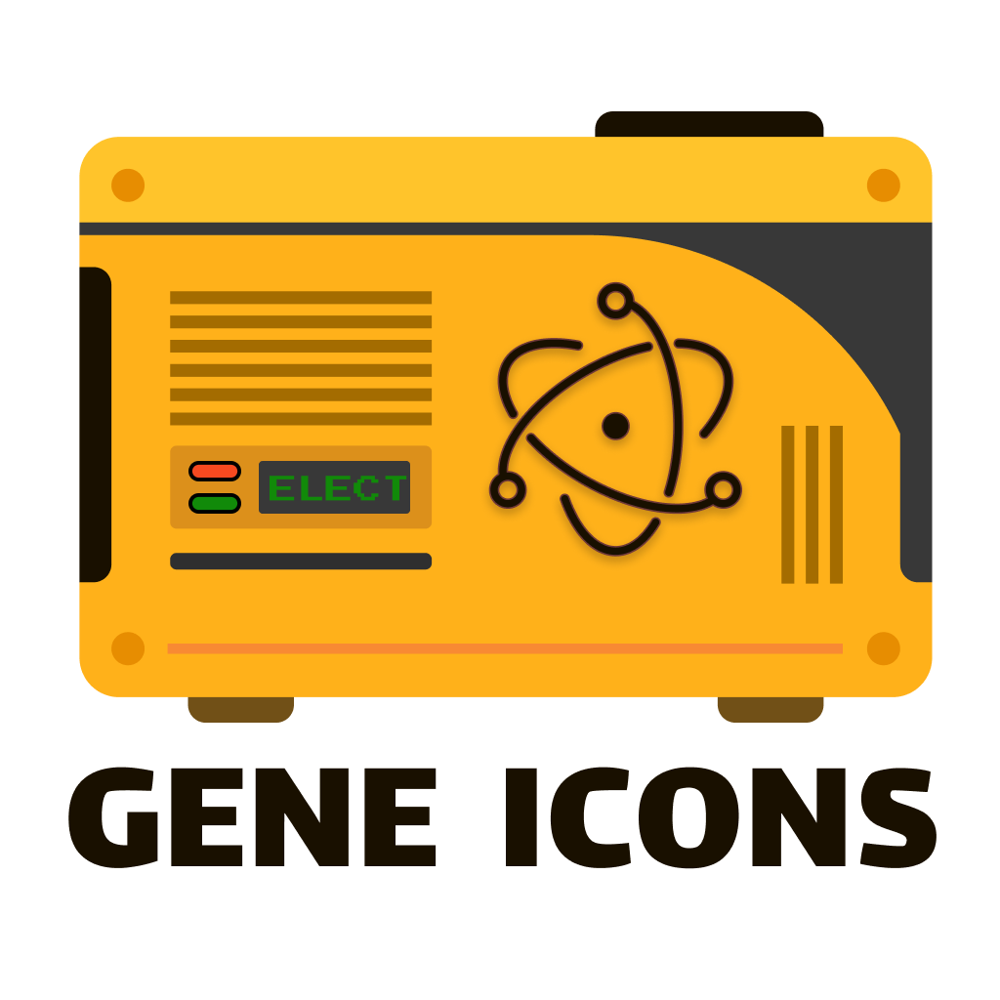
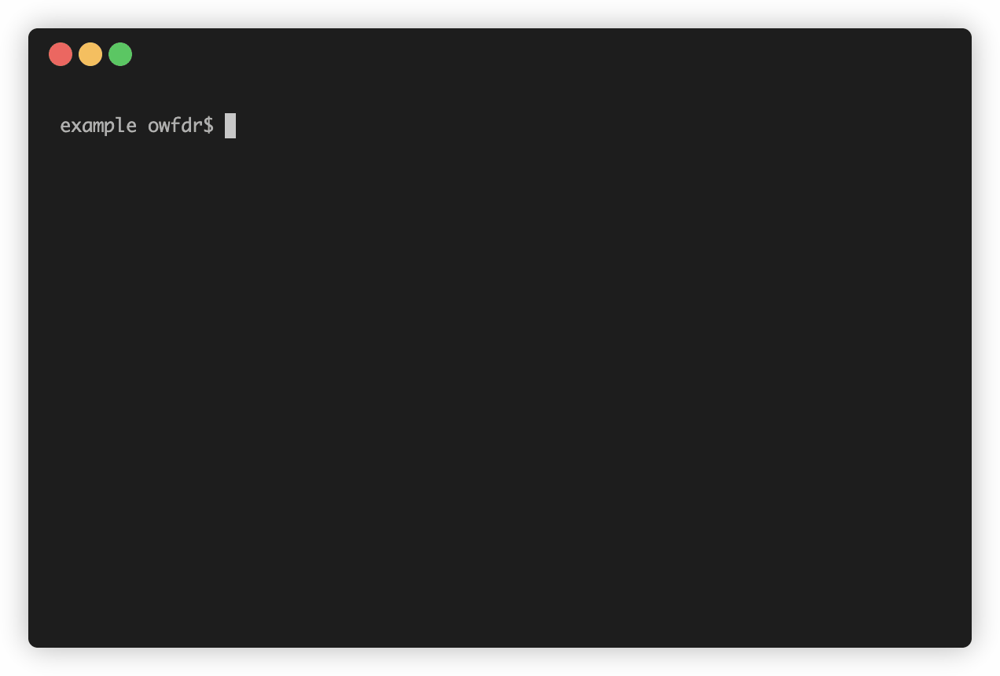

# Generate Electron Icons

Generate all required Electron icons from a PNG image.



Following icons will be generated.

- icon.icns (windows) ✓
- icon.ico (mac) ✓
- [16x ~ 1024x].png ✓

## Usage

Install Globally

```bash
npm install -g @owfdr/generate-electron-icons
```

Run Command

```bash
gene-icons --input <path-to-png-image>
```

## Arguments

| Argument | Description | Default |
| --- | --- | --- |
| `--input` | Which PNG file to use. Should be 1024x1024 | `icon.png` |
| `--output` | Where to put generated icons | `gene-icons/` |
| `--flatten` | Put all icons in the same folder| `false` |

## 🧑‍💻 Other Apps

Check out:

- [Our World](https://ourworld.center/apps) (Official Website)
